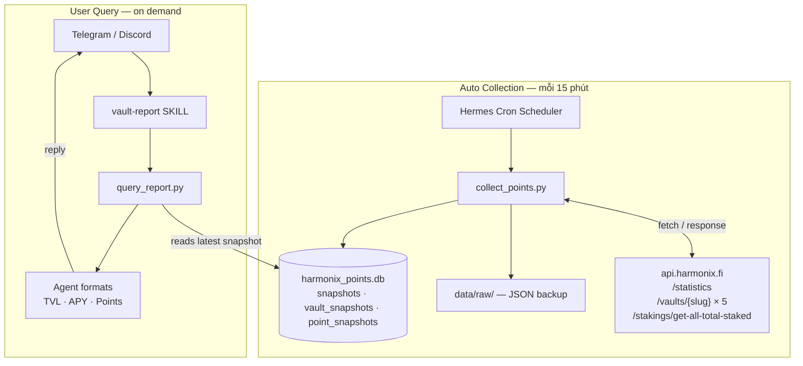

# harmonix-point

Hermes agent theo dõi Harmonix DeFi vaults — tích hợp Telegram/Discord, thu thập dữ liệu định kỳ, báo cáo TVL/APY/Points.

## Luồng hoạt động



## Tổng quan

Agent chạy trên [Hermes](https://hermes-agent.nousresearch.com/) và làm 3 việc chính:

1. **Thu thập dữ liệu** — cron job chạy mỗi 15 phút, gọi Harmonix API và lưu vào SQLite
2. **Báo cáo vault** — khi user hỏi về vault/TVL/APY/points, agent query DB và format output
3. **Tích hợp Telegram/Discord** — nhận tin nhắn, trả lời khi được mention `harmonix`

## Thông số

Scripts thu thập từ API Harmonix: statistics (tổng TVL, depositors, staking), vault details (TVL, APY, price/share, risk), và points (Harmonix, hypurrfi, kPoints, ventuals, usefelix).

## Cấu trúc thư mục

```
harmonix-point/
├── distribution.yaml          # metadata: tên, version, env_requires
├── SOUL.md                    # personality và instructions của agent
├── config.example.yaml        # template config (copy → config.yaml)
├── .env.example               # template env vars (copy → .env)
├── .gitignore
│
├── bin/
│   ├── collect_points.py      # fetch Harmonix API → lưu SQLite
│   └── query_report.py        # đọc SQLite → in báo cáo
│
├── cron/
│   ├── jobs.example.json      # template cron job (để tham khảo)
│   └── jobs.json              # runtime — KHÔNG commit
│
├── skills/
│   └── harmonix/
│       └── vault-report/
│           └── SKILL.md       # skill hướng dẫn agent cách báo cáo vault
│
└── data/                      # runtime — KHÔNG commit
    └── harmonix_points.db

```


## Cron Job

Cron job `harmonix-vault-collector` chạy tự động mỗi 15 phút qua Hermes scheduler. Cấu hình trong `cron/jobs.json` — file này được Hermes quản lý, không sửa tay. Xem `cron/jobs.example.json` để biết cấu trúc.

Để xem trạng thái: hỏi agent `"cron job đang chạy không?"` hoặc kiểm tra `cron/jobs.json`.

## Skills

### `vault-report`

Skill hướng dẫn agent cách query DB và format báo cáo vault. Agent tự động load skill này khi user hỏi về vault, TVL, APY, points.

Để thêm skill mới: tạo folder `skills/harmonix/<tên-skill>/SKILL.md` theo cùng format.
